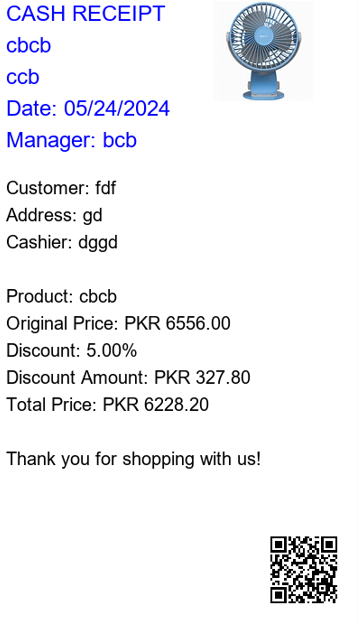

# Bill Generator

**Author**: Muhammad Yousaf  
**Email**: yousafsahiwal3@gmail.com

## Overview

The Bill Generator is a Python application that creates a receipt in the form of an image. This application uses the Tkinter library for the graphical user interface and the Pillow library for image processing. The receipt includes details such as shop information, product details, discount information, and a QR code.

## Features

- Input fields for shop details, customer details, product details, and discount.
- Option to browse and select a product image.
- Calculates discount and total price.
- Generates a receipt image with the provided details and a QR code.
- Displays the generated receipt image.

## Requirements

- Python 3.x
- Tkinter
- Pillow
- qrcode

## Installation

1. Ensure you have Python installed on your system.
2. Install the required libraries:
    ```sh
    pip install pillow qrcode[pil]
    ```

## Usage

1. Save the provided code in a file named `bill_genrater.py`.
2. Run the script using Python:
    ```sh
    python bill_genrater.py
    ```
3. Fill in the required details in the application window.
4. Click the "Browse" button to select a product image.
5. Click the "Generate Bill" button to create and display the receipt.

## Code Explanation

### Main Functions

- `create_bill`: This function creates the receipt image. It takes in various parameters like shop details, product details, customer details, and discount. It performs the calculations for the discount and total price, draws the text onto the image, adds the product image and QR code, and finally saves and displays the image.

- `generate_bill`: This function retrieves the input values from the GUI, converts them to the appropriate format, and calls the `create_bill` function to generate the receipt.

- `browse_image`: This function opens a file dialog to select a product image and sets the file path in the respective entry widget.

### GUI Setup

The GUI is created using Tkinter. Entry widgets are used to take input from the user for various details required to generate the bill. Labels are used to identify each input field. A button is provided to browse and select a product image. Another button is provided to generate the bill.

## Example

After filling in the details and generating the bill, the generated receipt will look similar to this:



## License

This project is open-source and available under the MIT License.

---

Feel free to reach out to the author via email at yousafsahiwal3@gmail.com for any queries or further assistance.
